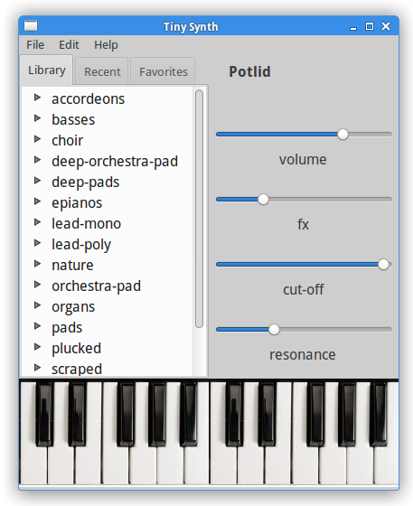

Tiny synth
=====================

The synthesizer written in Haskell/Csound with library csound-expression.
It illustrates the standard library of pathes from
the library csound-expression. It's implemented in Haskell
The UI part is made wxPython. It's just a prototype so some parts
are not implemented yet (filtering and custom temperaments).

Installation
-------------------

To install it you need to install python bindings to Csound API.

On Linux you can get it by installation of the package `python-csound`.
For example for Debian-like systems it can go like this:

~~~
> sudo apt-get install python-csound
~~~

For Windows users you can get the python bindings with 
installation of Csound audio language. 

On OSX it can be installed with `brew`.

When python bindings are installed you can install the synth
with python setuptools. Clone the repository:

~~~
> git clone https://github.com/anton-k/tiny-synth.git
> cd tiny-synth
> sudo python setup.py install
~~~

When it's completed you can invoke the synth from command line.
It's called `tiny-synth`:

~~~
> tiny-synth
~~~

Known issues
--------------------

The app depends on three python packages: python-csound, python-rtmidi, wxPython.
The first one should be installed manually the other two should be installed
automatically by `pip`. 

There might be problem with  installation of python-rtmidi.
Solution that might help is setting your compiler to gcc:

~~~
> env CC=gcc pip install python-rtmidi
~~~

Right now the app works with Csound 6.02-6.03 but not with 6.06.
